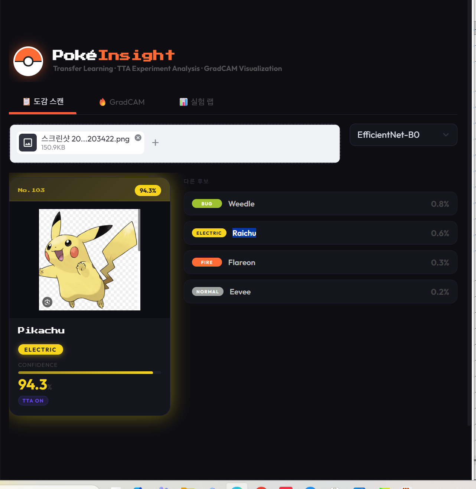
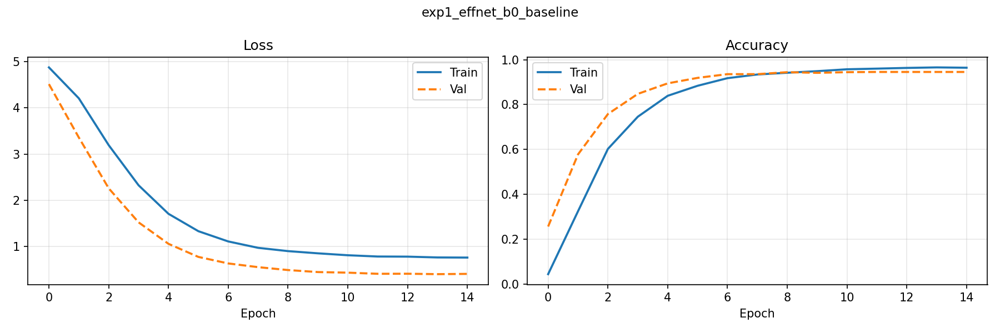
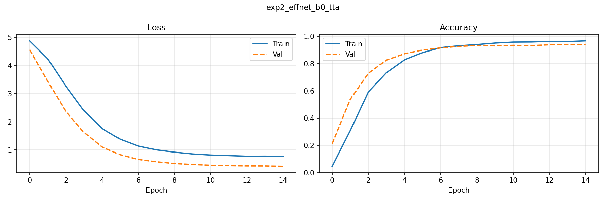
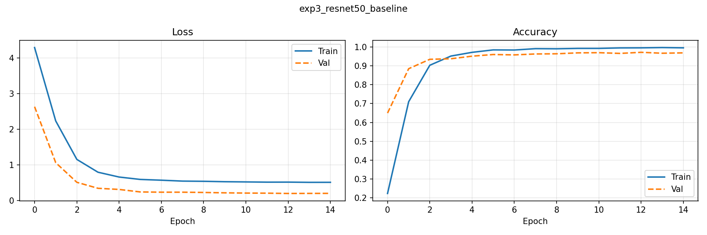
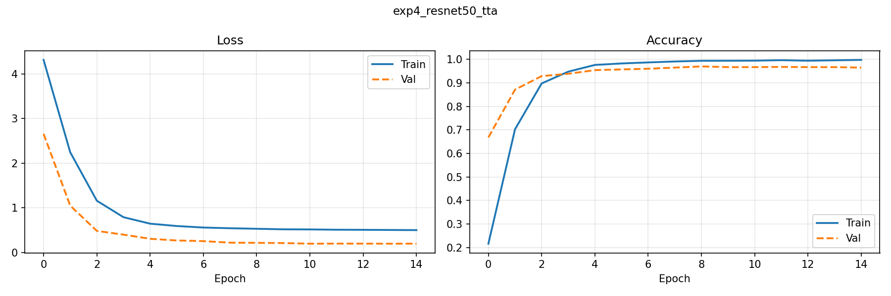

# PokéInsight — Pokemon Classification with Transfer Learning

Pokemon image classifier using Transfer Learning with TTA (Test-Time Augmentation) analysis and GradCAM visualization.

**Research Question**: How do architecture choice (EfficientNet-B0 vs ResNet-50) and TTA affect classification performance?

---

## Demo



---

## Experiment Design

| Experiment | Backbone | Pretrained | TTA | Purpose |
|---|---|---|---|---|
| exp1 | EfficientNet-B0 | ✅ | ❌ | Baseline |
| exp2 | EfficientNet-B0 | ✅ | ✅ | Measure TTA effect |
| exp3 | ResNet-50 | ✅ | ❌ | Architecture comparison |
| exp4 | ResNet-50 | ✅ | ✅ | Best combination |

- All 4 experiments trained under identical conditions (same data split, same hyperparameters)
- TTA: averages softmax probabilities across 6 different transforms of the same image

---

## Results

| Experiment | Accuracy | Precision | Recall | F1 |
|---|---|---|---|---|
| EfficientNet-B0 \| No TTA | 0.9365 | 0.9422 | 0.9341 | 0.9334 |
| EfficientNet-B0 \| TTA    | 0.9374 | 0.9456 | 0.9351 | 0.9354 |
| ResNet-50 \| No TTA       | 0.9629 | 0.9696 | 0.9618 | 0.9615 |
| ResNet-50 \| TTA          | 0.9619 | 0.9665 | 0.9617 | 0.9607 |

**Key Findings**
- ResNet-50 outperforms EfficientNet-B0 by ~2.5% in accuracy
- TTA slightly improves EfficientNet-B0 (+0.09%) but has minimal effect on ResNet-50
- Transfer learning with pretrained weights is highly effective for Pokemon classification

---

## Learning Curves






---

## Project Structure

```
Pocketmon-classifier/
├── src/
│   ├── config.py         # Paths, hyperparameters, experiment definitions
│   ├── dataset.py        # Stratified split (70/15/15), TTA transforms
│   ├── model.py          # EfficientNet-B0 / ResNet-50 backbone builder
│   ├── trainer.py        # Training loop with AMP
│   ├── tta.py            # TTA inference module
│   ├── evaluate.py       # Accuracy / Precision / Recall / F1
│   ├── gradcam.py        # GradCAM heatmap visualization
│   └── utils.py          # Seed, curve saving, JSON export
├── curves/               # Learning curve PNGs
├── screenshots/          # Demo screenshots
├── run_experiments.py    # Main training script
├── app.py                # Streamlit demo GUI
└── requirements.txt
```

---

## Getting Started

### Installation
```bash
pip install -r requirements.txt
```

### Dataset
Download [7,000 Labeled Pokemon](https://www.kaggle.com/datasets/lantian773030/pokemonclassification) from Kaggle and place it as:
```
data/
└── PokemonData/
    ├── Abra/
    ├── Bulbasaur/
    └── ... (150 class folders)
```

### Training
```bash
python run_experiments.py
```

### Demo GUI
```bash
streamlit run app.py
```

---

## Key Features

- **TTA (Test-Time Augmentation)**: Averages predictions across 6 augmented views at inference time — not implemented in any reference repos
- **GradCAM Visualization**: Highlights which regions of the image influenced the model's decision
- **Pokédex Card UI**: Dynamic color theme based on Pokemon type, built with Streamlit
- **AMP + Label Smoothing**: Mixed Precision training with label smoothing (0.05)
- **Stratified Split**: Class-balanced 70/15/15 train/val/test split using sklearn

---

## Dataset

[7,000 Labeled Pokemon](https://www.kaggle.com/datasets/lantian773030/pokemonclassification) — 150 classes, Kaggle
